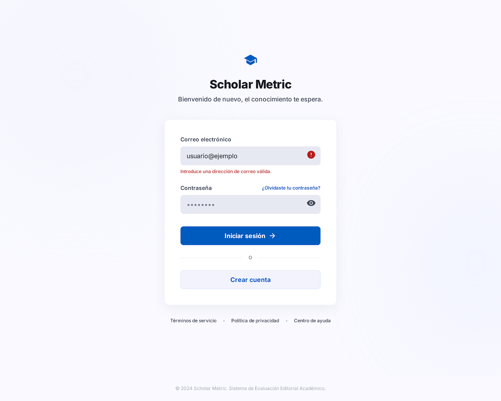
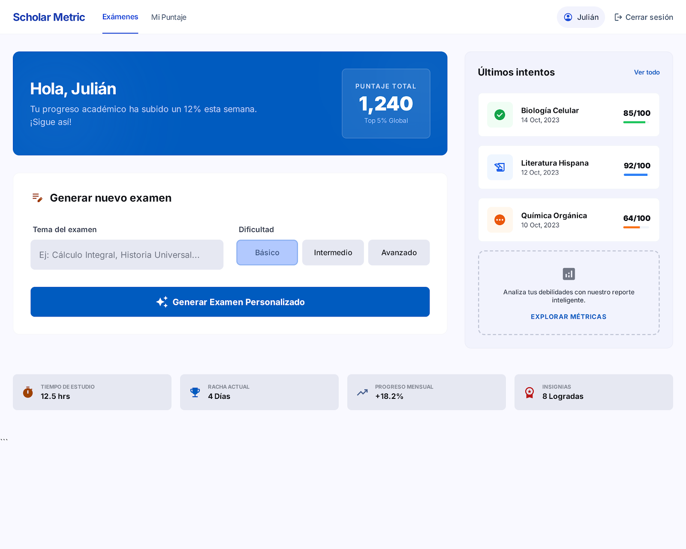
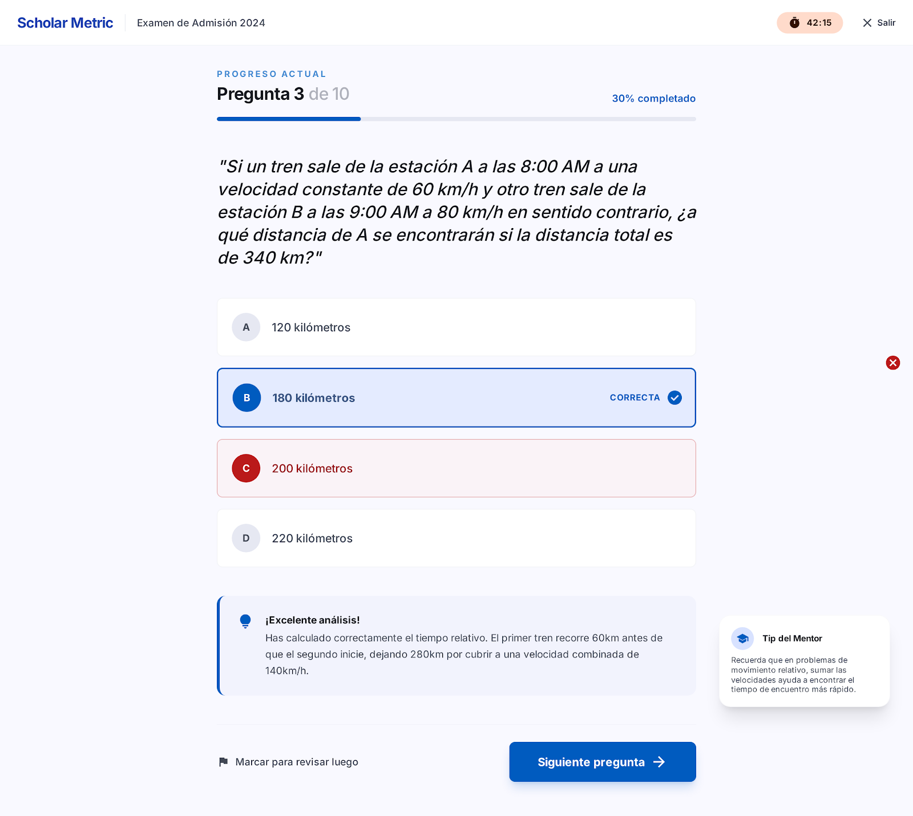
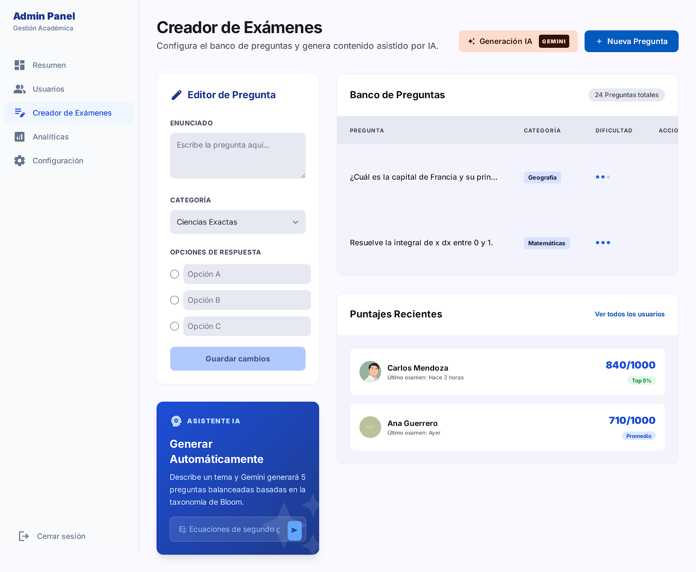

# Generador de Exámenes

Plataforma web para generar, administrar y responder exámenes de forma dinámica usando inteligencia artificial.

---

## Tecnologías
 
- **Backend:** Next.js (App Router)
- **Base de datos:** SQLite (via Prisma)
- **IA:** Google Gemini API (generación de preguntas)
- **Autenticación:** JWT
- **Frontend:** Next.js + Tailwind CSS
- **Pruebas:** Playwright

---

## Modelo de Base de Datos

**usuarios**
| Campo | Tipo | Notas |
|---|---|---|
| id | INTEGER | llave primaria |
| nombre | TEXT | |
| email | TEXT | único |
| contraseña | TEXT | cifrada |
| puntaje_total | INTEGER | default 0 |

**preguntas**
| Campo | Tipo | Notas |
|---|---|---|
| id | INTEGER | llave primaria |
| tema | TEXT | |
| enunciado | TEXT | |
| dificultad | TEXT | fácil / media / difícil |

**respuestas**
| Campo | Tipo | Notas |
|---|---|---|
| id | INTEGER | llave primaria |
| pregunta_id | INTEGER | llave foránea → preguntas |
| texto | TEXT | |
| es_correcta | INTEGER | 0 o 1 |

**intentos**
| Campo | Tipo | Notas |
|---|---|---|
| id | INTEGER | llave primaria |
| usuario_id | INTEGER | llave foránea → usuarios |
| pregunta_id | INTEGER | llave foránea → preguntas |
| respuesta_id | INTEGER | llave foránea → respuestas |
| es_correcto | INTEGER | 0 o 1 |

---

## Propuesta de API

**URL base:** `http://localhost:3000/api`

### Autenticación
| Método | Ruta | Descripción |
|---|---|---|
| POST | /auth/registro | Crear cuenta nueva |
| POST | /auth/entrar | Iniciar sesión |

### Preguntas
| Método | Ruta | Descripción |
|---|---|---|
| GET | /preguntas | Listar preguntas |
| POST | /preguntas | Crear pregunta |
| PUT | /preguntas/[id] | Editar pregunta |
| DELETE | /preguntas/[id] | Eliminar pregunta |
| POST | /preguntas/generar | Generar preguntas con IA |

Ejemplo de generación con IA:
```json
{
  "tema": "Revolución Mexicana",
  "cantidad": 10,
  "dificultad": "media"
}
```
Gemini devuelve 10 preguntas con 4 opciones cada una, donde solo una es correcta.

### Usuarios y Puntaje
| Método | Ruta | Descripción |
|---|---|---|
| GET | /usuarios | Listar usuarios |
| PUT | /usuarios/[id] | Editar usuario |
| DELETE | /usuarios/[id] | Eliminar usuario |
| POST | /usuarios/[id]/responder | Registrar respuesta y actualizar puntaje |
| GET | /usuarios/[id]/puntaje | Ver puntaje del usuario |

---

## Pantallas

1. **Inicio de sesión / Registro** — formulario para entrar o crear cuenta
    
2. **Inicio** — bienvenida, puntaje del usuario y opción para generar un examen por tema
    
3. **Examen** — preguntas una por una con sus opciones de respuesta
    
4. **Resultado** — puntaje obtenido y resumen del examen
    
5. **Administración** — CRUD de preguntas y vista de usuarios con puntajes
    
---

## Integrantes

| Nombre | GitHub |
|---|---|
| Samantha Betanzo Bolaños  | @sami604 |
| Bryan Gregory Hernandez de los Angeles | @jtagutm |